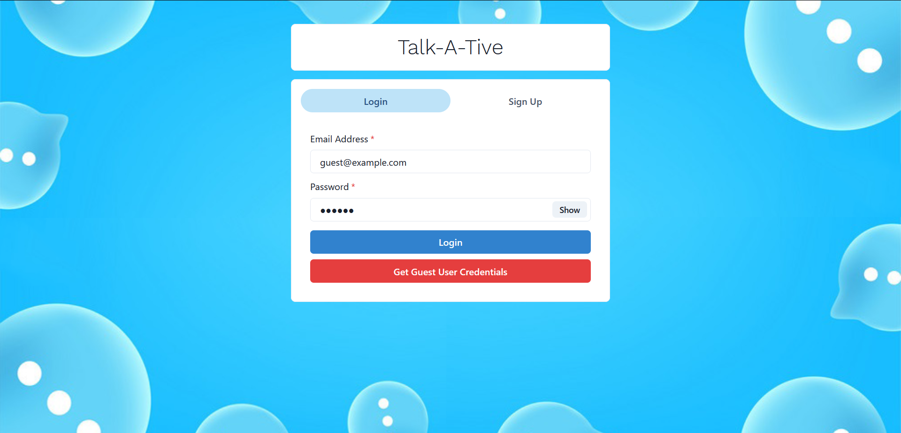
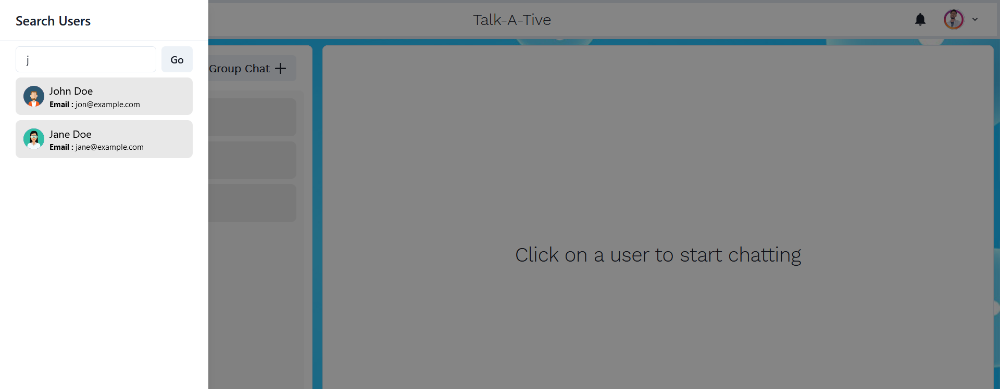

# Talk-A-Tive

Talk-a-tive is a Full Stack Chatting App.
Uses Socket.io for real time communication and stores user details in encrypted format in Mongo DB Database.
## Tech Stack

**Client:** React JS

**Server:** Node JS, Express JS

**Database:** Mongo DB
  
## Demo

https://talk-a-tive-06cc.onrender.com/


## Run Locally

Clone the project

```bash
  git clone https://github.com/jatin429/MERN-Chat-App.git
```

Go to the project directory

```bash
  cd mern-chat-app
```

Install dependencies

```bash
  npm install
```

```bash
  cd frontend/
  npm install
```

Start the server

```bash
  npm run start
```
Start the Client

```bash
  //open now terminal
  cd frontend
  npm start
```

  
# Features

### Authenticaton


### Real Time Chatting with Typing indicators

### One to One chat

### Search Users

### Create Group Chats

### Notifications 

### Add or Remove users from group

### View Other user Profile

## Made By

- [@Jatin Jain](https://github.com/jatin429)

  
